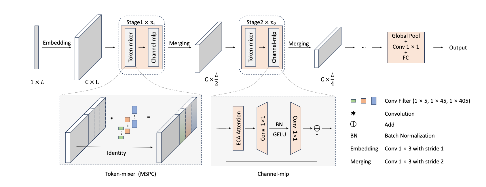

# Classification of astronomical spectra based on multi-scale partial convolution



## Environment

> - Ubuntu Server 22.04 LTS
> - Python 3.10.8
> - CUDA 11.7
> - CUDNN 8.5

Create a new conda environment and install the required packages:

```shell
conda create -n mspc python=3.10
conda activate mspc
conda install pytorch torchvision torchaudio pytorch-cuda=11.7 -c pytorch -c nvidia
pip3 install opencv-python matplotlib scipy scikit-learn tqdm tensorboard tensorboardX torchinfo
```

Before training, check the `cfg/cfg.py` file to set your training configuration.

## Data Download

All data can be downloaded from the [SDSS](http://cas.sdss.org/dr18/) and [LAMOST](http://www.lamost.org/public/?locale=en) official websites according to the fields in the data folder.

## Dataset Directory Structure

Support K-fold cross-validation.

```
├── DATASET
│   ├── fold 1
│   │   ├── train
│   │   │   ├── xxx 1.csv
│   │   │   ├── xxx 2.csv
│   │   │   └── ...
│   │   ├── val
│   │   │   ├── yyy 1.csv
│   │   │   ├── yyy 2.csv
│   │   │   └── ...
│   │   ├── test
│   │   │   ├── zzz 1.csv
│   │   │   ├── zzz 2.csv
│   │   │   └── ...
│   ├── fold 2
│   │   ├── ...
│   ├── fold 3
│   │   ├── ...
└── ...
```
